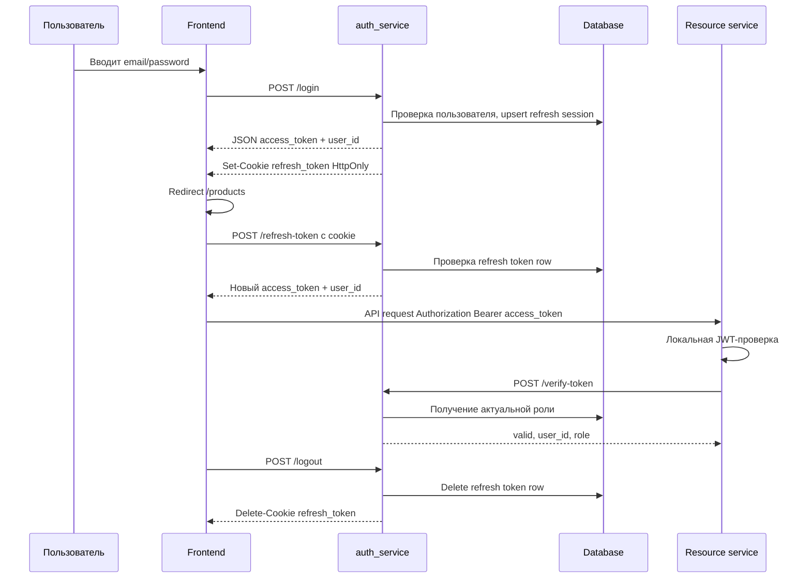

# Авторизация и сессия

Документ описывает текущую схему входа пользователя, хранения токенов и восстановления UI-сессии после обновления страницы.

## Ключевая идея

Приложение не использует классическую серверную session-cookie авторизацию. Используется схема:

```text
короткий access JWT + долгий refresh JWT в HttpOnly cookie
```

- `access_token` нужен для защищенных API-запросов.
- `refresh_token` нужен только для получения нового `access_token`.
- `refresh_token` не возвращается в JSON и не доступен JavaScript.
- Роли не кладутся в access token; актуальная роль берется из `auth_service`.
- `localStorage` не является источником auth-state.

Основные файлы:

- [auth_service/app/auth.py](/Users/metaf/Dev/git/StoreSystem-app/auth_service/app/auth.py)
- [auth_service/app/routes.py](/Users/metaf/Dev/git/StoreSystem-app/auth_service/app/routes.py)
- [auth_service/main.py](/Users/metaf/Dev/git/StoreSystem-app/auth_service/main.py)
- [auth_service/static/js/auth.js](/Users/metaf/Dev/git/StoreSystem-app/auth_service/static/js/auth.js)
- [auth_service/static/js/form_login.js](/Users/metaf/Dev/git/StoreSystem-app/auth_service/static/js/form_login.js)

## Что хранится на клиенте

`access_token`:

- хранится только в памяти текущей страницы в `cachedAccessToken`;
- теряется при reload, закрытии вкладки или новом документе;
- не пишется в `localStorage`;
- используется в заголовке `Authorization: Bearer <access_token>`.

`refresh_token`:

- хранится в cookie `refresh_token`;
- ставится сервером через `Set-Cookie`;
- имеет флаги `HttpOnly`, `SameSite=Lax`, `Path=/`;
- в локальной разработке ставится с `Secure=false`;
- не читается из JavaScript.

`user_id`:

- находится в JWT claim `sub`;
- хранится на странице в `cachedUserId`;
- возвращается из `/refresh-token`;
- не хранится в `localStorage`.

Роль:

- хранится в таблице `users.role`;
- запрашивается через `/me` или `/verify-token`;
- обновляется для UI через polling в `check_superadmin.js`.

## Login flow

1. Пользователь вводит `email`, `password`, `remember_me`.
2. Frontend отправляет:

```http
POST /login
Content-Type: application/json

{
  "email": "user@example.com",
  "password": "password",
  "remember_me": true
}
```

3. `auth_service` проверяет email и пароль.
4. Сервер создает два JWT:
   - `access_token` с `token_type=access`;
   - `refresh_token` с `token_type=refresh`.
5. В JSON-ответ возвращается только `access_token`:

```json
{
  "user_id": "uuid",
  "message": "User successfully logged in",
  "access_token": "jwt",
  "token_type": "bearer"
}
```

6. `refresh_token` приходит отдельно в HTTP header:

```http
Set-Cookie: refresh_token=<jwt>; HttpOnly; SameSite=Lax; Path=/
```

7. Frontend перенаправляет пользователя на `/products`.

Важно: `refresh_token` не находится в body ответа. API- и UI-тесты должны читать его из cookies ответа.

## Восстановление после reload

После reload access token в памяти страницы исчезает.

Порядок восстановления:

1. Скрипт страницы вызывает `getTokenFromDatabase()`.
2. Если `cachedAccessToken` есть и не истек, он используется сразу.
3. Если access token отсутствует или истек, frontend вызывает:

```http
POST /refresh-token
Cookie: refresh_token=<jwt>
```

4. Сервер проверяет:
   - подпись и `exp` refresh JWT;
   - `token_type=refresh`;
   - наличие refresh token в таблице `tokens`;
   - `refresh_expires_at`.
5. Если refresh валиден, сервер возвращает новый access token:

```json
{
  "user_id": "uuid",
  "access_token": "new-access-jwt"
}
```

6. Frontend кладет новый access token только в память страницы.

Если cookie отсутствует или невалидна, `/refresh-token` возвращает `200` с пустыми полями:

```json
{
  "user_id": null,
  "access_token": null
}
```

После этого UI остается на login page или перенаправляет пользователя на `/login`.

## Защищенные API-запросы

Все защищенные запросы отправляют access token:

```http
Authorization: Bearer <access_token>
```

Проверка access token состоит из двух уровней.

Локальная JWT-проверка:

- подпись `HS256`;
- claim `exp`;
- claim `sub`;
- `token_type=access`;
- старые access tokens без `token_type` временно принимаются для совместимости.

Проверка актуального пользователя и роли:

- `/verify-token` декодирует access token;
- ищет пользователя в БД;
- возвращает свежую роль из `users.role`.

Ресурсные сервисы (`products_service`, `orders_service`, `chat_service`) сначала декодируют JWT локально, затем вызывают `/verify-token`, когда им нужны актуальные `user_id` и `role`.

## Роли

Поддерживаются роли:

```text
customer < operator < admin
```

Access token не содержит role claim. Это сделано намеренно: если роль пользователя изменилась, новый статус должен применяться сразу на следующем запросе к `/me` или `/verify-token`, а не после истечения access token.

UI получает роль через `/me` и обновляет видимость элементов через `check_superadmin.js`.

## Logout

1. Frontend вызывает:

```http
POST /logout
Cookie: refresh_token=<jwt>
```

2. Сервер удаляет запись refresh token из таблицы `tokens`.
3. Сервер удаляет cookie `refresh_token`.
4. Frontend очищает `cachedAccessToken`, `cachedUserId` и редиректит на `/login`.

Logout отзывает refresh token. Уже выданный access token остается валидным до `exp`, потому что access JWT проверяется stateless.

## Single-session behavior

В таблице `tokens` первичный ключ - `user_id`. Поэтому у пользователя сейчас одна refresh-сессия.

Новый login тем же пользователем:

- перезаписывает строку в `tokens`;
- делает старый refresh token недействительным;
- не отзывает уже выданный access token мгновенно.

## Прогретая UI-сессия для автотестов

Чтобы открыть браузер уже авторизованным:

1. Выполнить API login.
2. Взять `refresh_token` из response cookies, а не из response body.
3. Положить cookie `refresh_token` в браузер на тот же origin, где открыт UI.
4. Открыть `/login` или защищенную страницу.
5. UI сам вызовет `/refresh-token` и получит access token.

В браузер не нужно класть `access_token` или `user_id`.

## Диаграмма



## Связанные документы

- [Технические требования: авторизация и JWT-сессия](/Users/metaf/Dev/git/StoreSystem-app/docs/authentication-requirements.md)
- [Техническая документация: авторизация и JWT-сессия](/Users/metaf/Dev/git/StoreSystem-app/docs/authentication-technical-docs.md)
